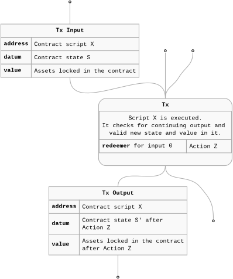
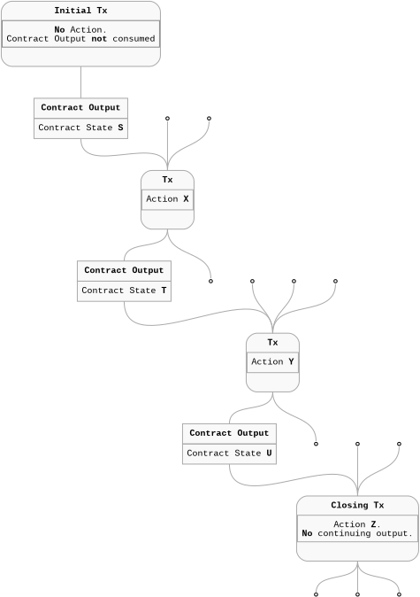
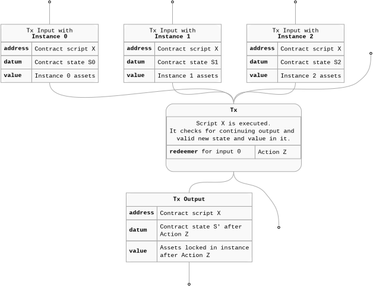

## Introduction

As we are working on two flavours of CL (Cardano Lightning) protocols and implementing and designing three different types of CL nodes we are facing the problem of the on-chain state tracking from a few different perspectives. In this short series I will try to define our specific indexing needs and outline the solutions which we use or plan to use. I believe that our requirements are somewhat representative to a broad class of DApps so hopefully you will find them useful.
Along the way I will do some recap of the basics so don't worry if you are new to the Cardano or EUTxO model. Some examples will be provided also in a `TypeScript` and `SQL` form but only to provide another angle. If you don't know these languages, you can just skip the code snippets altogether and still get the idea.

### The plan

In this part I will:

* Introduce a generic "single threaded" smart contract flow on extended UTxO blockchain (EUTxO) like Cardano.

* Describe our two specific threading styles which optimize for batch execution and which will be used as a baseline for the rest of the series.

* Discuss a possible transaction submission pipeline and its requirements.


### Nomenclature

We use term "user" rather freely in this part, sometimes it literally means a person interacting with a UI but it can also mea a backend system daemon. For example, in the case of a Lightning node, the backend node itself is the user which can manage liquidity automatically.

We use terms "script", "smart contract", "validator" and even a "channel" (which is Cardano Lightning specific) interchangeably across the posts. Transaction id and transaction hash or two other synonyms used.

Even though `UTxO` should be "unspent" we sometimes use this term when we mean a "historical UTxO" (spent unspent transaction output :-P).


## To index or not to index

### What do you mean by indexing?

In the context of blockchain(s) an indexer is a piece of software which tracks "some" part (whole is a part as well ;-)) of on-chain state and  keeps those data in an indexed form optimized for some querying and filtering. So indexing is what indexer does...

### What about cardano node?

TL;DR cardano node is not appropriate for tracking and querying the on-chain state and we need to track, organize and expose the on-chain data which we are interested in ourselves.

The state of the art cardano node does not expose any **direct** query API for the historical data like transactions, consumed utxos, assets etc. It exposes a simple API which allows you to query the current UTxO set. Even this API should not be used for serious querying though as it is non optimized for that and can be a bottleneck in production.

On the other hand the node exposes ["chain sync" protocol](https://ouroboros-consensus.cardano.intersectmbo.org/docs/references/miscellaneous/chain_sync/) which provides an event feed and passes to the subscriber new blocks or information about rollbacks. Speaking the binary protocol of cardano-node can be tedious if you don't have ready to use encoders but you can use also [ogmios](https://ogmios.dev/) which is a proxy and translate chain sync into JSON/RPC.

### Should I sync and index myself?

I would say "no". At least "no" before you explore some ready to use options of which are many: [Cardano Db Sync](https://github.com/IntersectMBO/cardano-db-sync), [Blockfrost](https://blockfrost.io/), [Kupo](https://cardanosolutions.github.io/kupo/), [Cexplorer API](https://cexplorer.apidocumentation.com/cexplorer-api), [Cardano Scan API](https://docs.cardanoscan.io/) or [Koios](https://koios.rest/). For sure I missed some - sorry. We will try to shortly introduce a few of them in this series.


## Smart contract execution basics

But first let's take a step back and look at the problem more broadly - which data pieces we are really interested in. We will focus on a specific type of contract which we shall introduce.

On Cardano, smart contracts together with their state live inside UTxOs. Since every UTxO is immutable any new contract state requires a new UTxO holding it. That new state should be locked at the same smart contract address with all the assets carried over as needed. Of course the old state has to be processed and consumed first, which means that a transaction should grab the current UTxO and create a new one with the updated state.



In a simple case (no forks) this creates an **execution thread** — a linear chain of connected UTxOs linked together by transactions. Each step in this thread is a transaction that:

  * Consumes a contract instance UTxO with the current state.

  * Provides inputs parameters to the smart contract through a redeemer.

  * Outputs a new state and locks it in the UTxO under the same script address.



The above diagram presents a simplified thread with 3 transitions.

From the smart contract perspective a single step is like a method call (or state machine transition if you prefer), where the `redeemer` should indicate which method is actually called and provide arguments for that call. The contract logic then verifies if a proper resulting state given that call is stored in the new UTxO and if all the other expected "side effects" and conditions are correctly implemented by the rest of the transaction. It can check for example, if the right amount of ADA was paid to some address or if a transaction was signed by required user key.

### Tracking an instance

What is usually needed from that kind of DApp perspective is the current state (datum + assets) of the contract on the chain so the appropriate party can choose the next step when needed and execute it. This simple assumption could lead to a design which only needs to query the current UTxOs snapshot instead of the full thread history. With snapshots the picture can become more murky when we consider rollback recovery and our general understanding of the state maturity. Disambiguation of the thread from some malicious UTxO "mimics" can be also a bit tricky when we are working with the snapshots alone.

From my experience it is easier to stick to a more honest thread representation of the on-chain state and derive from it on the app level the current domain level situation. That extra tx thread context allows us to gain better understanding of what is really happening. We can do more informed decisions when to execute the next action, retry it or repeat it all together. We can also present to the user or system admin the tx history which gives more context to the rollbacks which lead to unsuccessful interactions attempts.

### Modelling the thread

We *can* represent the above using `TypeScript` types as follows.

```typescript

type TransactionId = Uint8Array;
type TransactionInfo = TransactionId

type InitialTransaction<State, Redeemer, TransactionInfo> ={
  datum: State;
  outIdx: number;
  next: TransitionTransaction<State, Redeemer> | ClosingTransaction<Redeemer> | null;
  txInfo: TransactionInfo;
}

type TransitionTransaction<State, Redeemer, TransactionInfo> = {
  datum: State;
  outIdx: number;
  next: TransitionTransaction<State, Redeemer> | ClosingTransaction<Redeemer> | null;
  redeemer: Redeemer;
  txInfo: TransactionInfo;
}

type ClosingTransaction<Redeemer, TransactionInfo> = {
  redeemer: Redeemer;
  txInfo: TransactionInfo;
}

type Transaction<State, Redeemer, TransactionInfo> =
    InitialTransaction<State, Redeemer, TransactionInfo>
  | TransitionTransaction<State, Redeemer, TransactionInfo>
  | ClosingTransaction<Redeemer, TransactionInfo>;

type Thread<State, Redeemer, TransactionInfo> = InitialTransaction<State, Redeemer, TransactionInfo>;

export const mapThread = <State, Redeemer, TransactionInfo, NewState, NewRedeemer, NewTransactionInfo>(
  thread: Thread<State, Redeemer>,
  mapState: (state: State) => NewState,
  mapRedeemer: (redeemer: Redeemer) => NewRedeemer
  mapTransactionInfo: (txInfo: TransactionInfo) => NewTransactionInfo
): Thread<NewState, NewRedeemer, NewTransactionInfo> => {
  // ...
};
```

I hope that I did not overcomplicate the types too much above but the structure proposed allows us to represent both - the raw on-chain data and the domain specific representation of the thread by mapping and changing the `State` and `Redeemer` of a thread.
The `TransactionInfo` type is a placeholder which could be used to attach for example maturity (block depth) information etc. by default it is just transaction id / hash.

## Cardano Lightning on-chain threading patterns

I will shortly picture two distinct on-chain validation and threading strategies which CL (Cardano Lightning) smart contracts use. Why we used two different styles? For (hacking) fun and (learning) profit. We will converge to a single style in the future when we will have a clear understanding of the trade-offs and performance implications implied by them.

To give you some minimal CL domain context both of our smart contracts protect funds provided by two parties. We call an instance of such contract the "payment channel" or just "channel". The assets locked can be distributed at some point according the `cheques` (yes, something like paper cheques) which are issued off-chain. Before the channel is closed, both parties can update the state of the channel - `add` or `subtract` funds from it.

### Commonalities

There is a requirement which we share across both protocols in CL - they should be optimized regarding time and cost for batched execution. The reasoning here is that the intermediary nodes (payment operators) who form a backbone of the CL network require efficient liquidity management across many payment channels.
This choice translates to a transaction which executes steps across multiple contract instances at once. Of course each instance transition should be validated so we have to match the right input UTxO with the right output UTxO.



In order to efficiently validate such a batch we decided to apply a transaction level validation approach. This means that the smart contracts which protect assets and state of a single UTxO will delegate validation responsibility to a single validator which will loop over the inputs and outputs and check every instance transition, contract initialization or closure.

### Validation through minting policy

{/*
Important details:
  * minting redeemer is used to provide a detailed description of the steps.
  * thread token can be used to do the pairing
*/}

Cardano Lightning bidirectional channels delegate validation to a minting policy which is executed once per transaction. Each channel UTxO validator [performs a single check](https://github.com/cardano-lightning/cardano-lightning/blob/cdc5fd93fcf47e6ff031c2a38310065e29056eee/aik/validators/cl.ak#L22) - if an expected minting policy is executed in the transaction.
The minting policy itself receives a [redeemer with a list of all the steps](https://github.com/cardano-lightning/cardano-lightning/blob/cdc5fd93fcf47e6ff031c2a38310065e29056eee/aik/lib/cl/types.ak#L79) which should be performed for every contract input. In the main loop our minting policy iterates over steps, inputs and outputs and validates given channel transition. Of course transaction inputs, outputs and the steps from the redeemer should be arranged so this loop can be performed efficiently. All the new channel instances should be placed after the existing ones in the outputs.

#### Thread token

Because we use minting policy we can additionally mint a unique token and pass it to the new channel instance (we call it "thread token"). During channel closing transition token is burned. Every existing channel preserves its token and its amount is bumped by `1` so we can execute the minting policy even if a single step is executed alone (without openings or closures). Give that the token leakage is prevented and that the thread token can not be forged we can use it as a fully secure identifier which can reduce some complexity of the off-chain code. Of course handling that token requires extra on-chain resources - increased UTxO and transaction size, extra checks involving value filtering.


### Validation through the first spending validator

{/*
Important details:
  * spending redeemer is used to provide a detailed description of the steps.
  * no thread token
*/}

Cardano Lightning unidirectional channels delegate validation to the first spending validator. Every input validator receives a [redeemer which instructs it](https://github.com/cardano-lightning/konduit/blob/e1996934cb0cdb88022c04c050cdb205fbbb8321/packages/kernel/lib/konduit/types.ak#L94) to either delegate or to execute the full transaction validation itself. In this model there is no minting involved so no thread token is minted instead the channel identifier is stored in the datum. Given that **arbitrary UTxO can be created** on Cardano the output which is not marked with some unique token can be forged. In other words the off-chain code should disambiguate the actual channel instance from those kind of "mimics" which is another argument for a full thread indexing in this case.

## Stepping through

### Transaction Building

In addition to indexing, the DApp should facilitate user interaction with the smart contract. It should be able to build the next transaction which correctly extends the current thread of execution.

It is never enough to provide the smart contract input to the transaction because it can not cover the required transaction fees (it can not be used as a collateral input - it is a ledger rule) and of course it can not cover new deposits to the smart contracts as well.
The system has to be able to identify UTxOs which can be used to cover that expenses from the "user's wallet". It is usually impossible to know in advance which addresses the user will use to fund the transaction, so in the most generic case the DApp should be able to query any address from the current full UTxO set or use user's wallet to provide a funding UTxO pool.

### Transaction Submission

Building a transaction is only half the job — it must also be submitted and confirmed on the chain.

You can let the external user's wallet submit the transaction or submit it to your backend node or manage a bit more involved submission queue on your backend which will take care of the resubmissions.
Using only the wallet or direct node submission is simple but risky. Standard and very sensible cardano node behaviour is to not care about resubmissions - if "its own" transaction was rolled back it won't be reinserted into the mempool so it won't be included in the upcoming blocks. If a user's wallet or you backend uses only this simplified submission method then the transaction can be lost which could be severely consequential if there is approaching deadline imposed by the protocol which the system operates in.

A backend submission queue gives you full control and reliable resubmission on rollbacks. However, backend-only submission can cause issues sometimes if your user wallet would not know (till they are included in the block) that some its UTxOs were used in a transaction, potentially leading to double-spends. The recommended approach is a dual submission strategy: submit through your backend queue for reliability, while also forwarding the signed transaction to the wallet for submission so it stays aware of all the spent UTxOs.

### Is this even relevant?

It is. Your submission or resubmission logic should react to the on-chain changes. Ideally it should really recognize and react to the UTxO state changes - both the smart contract UTxO as well as the funding ones.

## What's next?

In the upcoming parts we will discuss in more depth two strategies of on-chain state tracking relevant to two different types of "users": backend system with some automatic administrative behaviours and user facing DApp without any extra backend.

