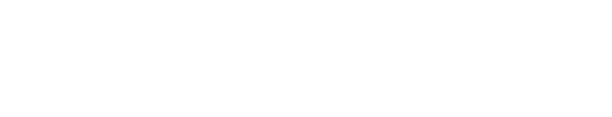
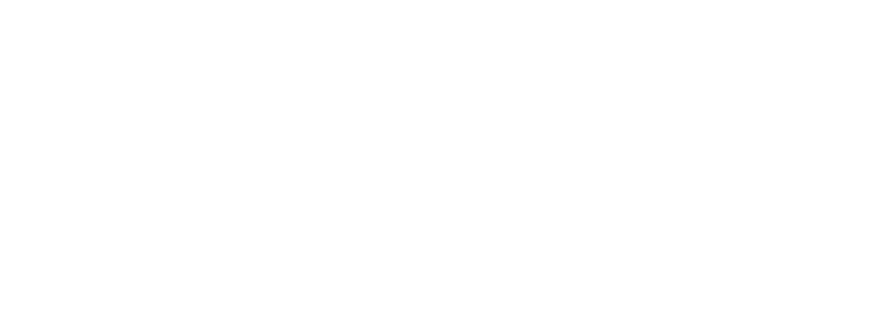
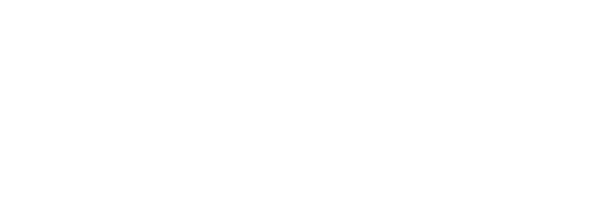
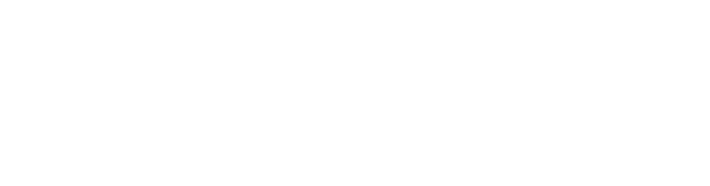
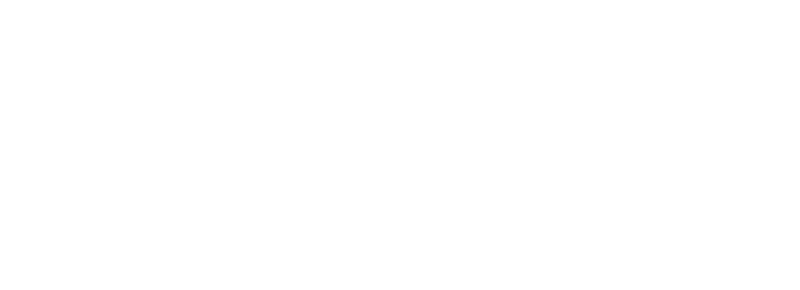

---

title: "Step 1: From Paper Cheques to Off-Chain Transactions"
date: 2024/06/29
description: "Old is New Again: Signing Cheques in the Blockchain Era."
author: paluh
---

This is the first part of the series [Baby Steps Guide to Cardano Lightning Network](/guide) which introduces the core concept of the project: digital cheques.
Let's use the traditional paper cheque analogy with some small twists to explain the main idea behind digital cheques.

So let me introduce the characters in this story:

You just received your meal and pay for it right away - you don't want to owe anything to anyone ;-) You sign a cheque for *$30*. This flow translates nicely to Cardano Lightning because digital cheques support custom currencies too, so you can easily issue a cheque for *$30* in your favorite stable coin!

After the main dish, you should leave because you know that sugar is bad for you...

But ice cream is so tempting... so you decide to stay and order one.

You wrote a new *$15* cheque for the dessert and when you were about to give it to the waiter, he explains that the cashier at the local bank cannot add up the amounts from multiple cheques. He just can't.

So the waiter asks you to write a cheque for the total amount of the meal, meaning the previous dish and the ice cream. You agree to do that. So he gives you the last cheque and you correct it so it is now for *$45*.

This is nearly how digital cheques work in the blockchain world as well. In the digital world we can not really overwrite amount on the old one - once it was issued it can be easily copied etc. What we only can do is we can just create another cheque for the higher amount and make the old one for lower amount naturally obsolete and we make it obsolete by simple incentive mechanism.

In the case of Bitcoin, because of scripting limitations, they implemented a sophisticated old cheque revocation mechanism so you cannot submit the previous *$30* cheque yourself to the blockchain quickly before waiter submits the last one for *$45* without being penlized. This was necessary in Bitcoin because parties exchange real transactions between themselves! In Cardano, we can make this protocol much, much simpler because of our smart contracts capabilities.

In Cardano, channels are guarded by smart contracts and in a single cash-out round only a single cash-out event is possible (in a uni-directional channel). In Cardano, we can ensure that only the "recipient" (waiter in this case) can submit and cash out the cheque. So naturally, it is in the best interest of the waiter to cash out the largest one. In other words, in CL when we issue a new cheque, we add up the amounts from the previous cheque and the new one and issue a single digital cheque for the total amount. This way we can avoid the complicated cheque revocation mechanism entirely and make cheques even public. The waiter (or any user of CL) can back them up safely even in non-safe and public storage!

One additional similarity between paper and digital cheques is that they are **instant** (you don't have to check the blockchain for confirmation, or state updates frequently etc.). So they can be used for regular payments but also for micropayments or for "pay as you go" online channels.

But let's go back to the restaurant. After all this delicious meal, you are ready to leave... but you are still a bit thirsty.

So you order a "little" bottle of wine :-P

And you bump the total amount to $60.

The next day, the waiter goes to the bank with the cheque you gave him. He passes the cheque to the cashier and the cashier checks the signature and the amount.

This analogy translates nearly directly to our digital cheques. Every cheque is just an amount, currency, and a signature. It will contain a small extra piece of information for which round in which channel it was issued, but this is a tiny detail. What is **really important** is that cheques themselves can be easily constructed or verified by everybody - `JavaScript` browser DApp, `Swift` or `Kotlin` mobile DApp, or `Aiken` smart contract on the chain which guards the assets. Portability and simplicity which drive adoption is **the key** here.

Additionally, the cash-out of the cheque can be understood from a blockchain perspective as a real transaction. All the previous steps were conducted off-chain in some sense. So in this particular case, we compressed three transactions (main dish, ice cream, and wine payments) into a single one on the L1. All those subtransactions were fully secured and **instant**. But still - it is not a really huge achievement given that in real CL there is also an extra preparation transaction needed. But please be patient - this is just the first step!

Let's go back to the bank for a moment. After preliminary verification of the cheque, the cashier discovers that your account in the bank is empty. So he can't cash out the cheque!

You cheated this poor waiter! You are a bad person! You should be ashamed of yourself!

In the case of CL, this situation is impossible because the funds are locked in the smart contract and both you and the waiter are aware of the maximum amount that can be cashed out. So the waiter will never accept a cheque that he can't cash out!

## Stay Tuned

So in this installment, we introduced the concept of digital cheques and a single direction channel. I hope that you were able to follow and that the analogy clarified the main idea rather than confused you.

We have many more interesting topics to discuss because a single and unidirectional channel is not really useful. An easy and practical addition could be at least a payback capability so probably we will discuss that in the next episode. So please stay tuned!

