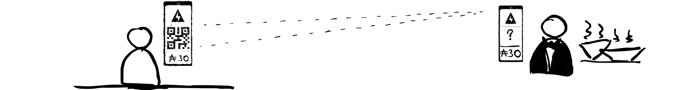
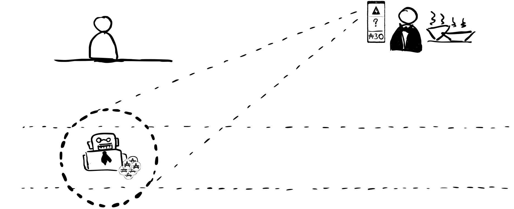
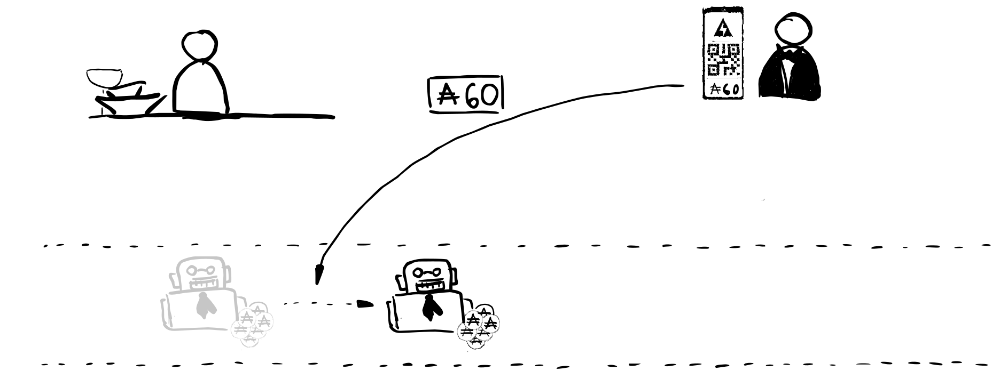

This is the second part of the series [Baby Steps Guide to Cardano Lightning Network](/guide). We show in it how to make channels "bidirectional" so the two involved parties can safely send money back and forth off-chain. We are still focusing on a single channel operations and exclude channels chaining from the picture. This is why the examples are limited and presenting not so appealing basic cash flows.

If you are new to the topic of bidirectional channels then the transfering assets in both directions doesn't sound like a really sophisticated feature. It doesn't sound like that because at its core it actually isn't...  On the Bitcoin blockchain which has limited scripting capabilities this extension requires pretty sophisticated penalty system and imposes a significant delay of cash-out procedure. Fortunatelly we are focusing on Cardano here so it won't be so hard.

Let's once again visit the restaurant:

You probably spotted a new character in our group. We have *Payment Channel Smart Contract* here because we actually want to use CL for the payment flow right from the beginning. Another new piece on our story cover is "Cardano Blockchain" - all the assets and our Smart Contaract will live there.

Before you can start paying instantly in the restaurant you have to open up a channel and lock some funds in it. These money is still yours and could be cashed out by you. When you start issuing cheques you will start losing part of the ownership of that sum and giving it to the restaurant. Charging is simple in this case - you can either coordinate this operation with the recipient directly or the restaurant could provide payment details on their web page. Information needed for the channel opening is an address and optionally separate signing information of the recipient. Charging can sometimes involve more coordination and require multisig transaction when both parties want to lock some funds in their corresponding "channel accounts". In this case we are the only one interested in fund locking.

*Let me repeat that once again - we are still focusing here on the besic mechanics of a *single channel* and we ignore channel chaining. That is why you have to open up a separate channel directly to the restaurant. Channel chaining will significantly impact the flow as you could open up a channel to a Payment Gateway which could connect you to many, many resturants or merchants at once. But this will be the topic of the next installment.*

After receiving money 

Let's use the traditional paper cheque analogy with some small twists to explain the main idea behind digital catcheques.

In Restaurant - first cheque:

In Restaurant - verifying channel:

In Restaurant - channel verified:

Main dish:

Dessert:

Wine:

Alcohol?:

Alcohol back:

Payback:

On chain state:

First cheque submission:

Second cheque submission:

On chain state:

Multisig:

Round closing cheque:

