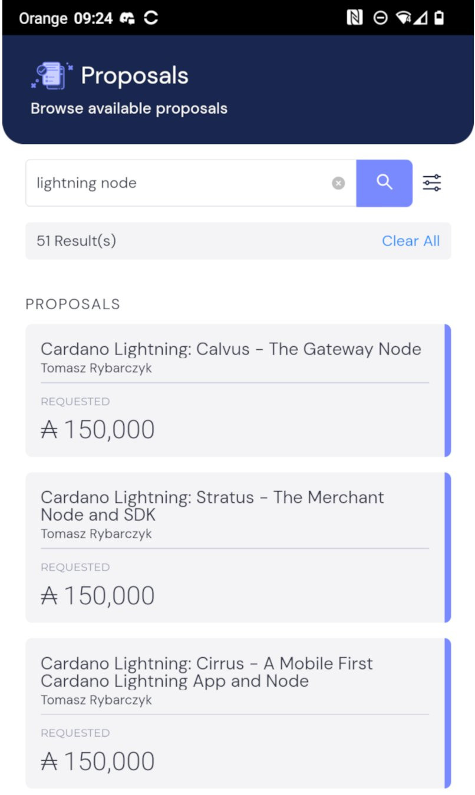

## Why Lightning?

+ Secure: The integrity of the L1

+ Near instant settlement

+ Highly scalable 

## F13 Catalyst Proposals

Cardano Lightning will be running in clouds. Search for **"lightning node"** and vote for us:

  

    <ul className="nx-mt-0 nx-ml-4 nx-list-disc">
      <li className="nx-mb-2">[Calvus - The Gateway Node][calvus]</li>
      <li className="nx-mb-2">[Cirrus - A Mobile First CL Node and App][cirrus]</li>
      <li className="nx-mb-2">[Stratus - The Merchant Node and SDK][stratus]</li>
    </ul>
  

  

[calvus]: https://cardano.ideascale.com/c/cardano/idea/131334
[cirrus]: https://cardano.ideascale.com/c/cardano/idea/131332
[stratus]: https://cardano.ideascale.com/c/cardano/idea/131329

## How it works

As the name suggests, Cardano Lightning is to be a port of [Bitcoin Lightning](https://lightning.network) to Cardano. 

The network is made up of bidirectional payment channels. 
A payment channel is some means by which one party can make a payment,
and the other party can receive it. 
Either party can close the channel at any time at no risk to the other party. 
In a bidirectional payment channel, payment can be made in both directions. 

The magic really happens in **hopping** from one payment channel to another. 
For example, if Bob has a payment channel with both Alice and Charlie,
then Alice can pay Charlie by effectively paying Bob and Bob paying Charlie.

## Roadmap

### Phase 1: Payment gateways

1. Protocol spec: Based on a lit review, together with a set of ADRs.
2. Smart contracts: Together with a full test coverage, and tx-building code.
3. Docs and SDKs: To build dapps atop Cardano Lightning, and facilitate product integrations.
4. POC: Hub and spoke network. 

### Phase 2: Routing & Discoverability

Continuing the work of phase 1 to a fully decentralised network with optimal channel routing.
